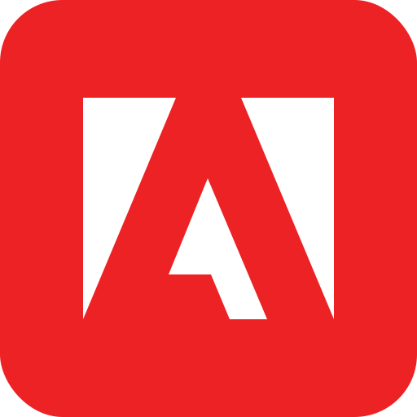

# 
 **Hey, how you doin ? :stuck_out_tongue_winking_eye:** 

(English version below :arrow_down:)

* :clipboard: Moi c'est Thomas, j'ai 18 ans et je suis en 2ème année à l'IIM Digital School à La Défense

* :telescope: J'aspire à être un développeur full-stack

* :surfing_man: Je suis passioné par le surf, j'en fais depuis une dizaine d'année, j'aime aussi écouter de la musique et coder

## Mes compétences

    
    
    
    
    

## 

* :clipboard: I’m Thomas, I’m 18 and I’m in my second year at IIM Digital School in La Défense

* :telescope: I’d like to be a full-stack developer

* :surfing_man: I’m passionate about surfing, I’ve been surfing for about ten years, I also like to listen to music and code

## My skills

    
    
    
    
    

## Contact 

